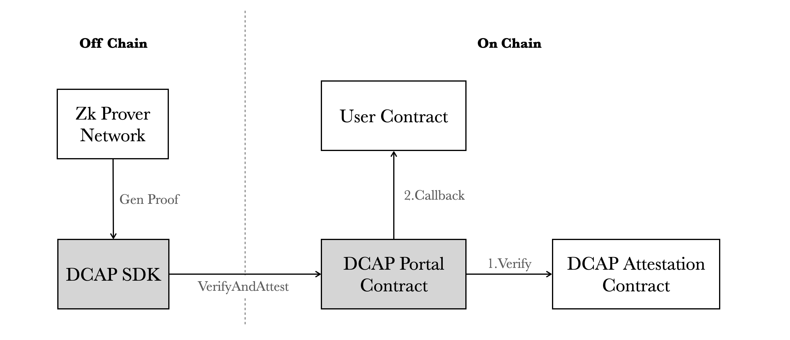

  <picture>
    <source media="(prefers-color-scheme: dark)" srcset="https://raw.githubusercontent.com/automata-network/automata-brand-kit/main/PNG/ATA_White%20Text%20with%20Color%20Logo.png">
    <source media="(prefers-color-scheme: light)" srcset="https://raw.githubusercontent.com/automata-network/automata-brand-kit/main/PNG/ATA_Black%20Text%20with%20Color%20Logo.png">
    
  </picture>

# DCAP SDK

## Introduction

DCAP SDK is a toolkit providing developers seamless integration with [Automata DCAP Attestation](http://github.com/automata-network/automata-dcap-attestation) into their codebase where they can perform either full on-chain or using ZK proofs to verify Intel SGX or TDX quotes.

## Packages

This SDK consists of the following packages:

* **[DCAP Portal Contract](./packages/dcap-portal/)**: is a user-facing contract called by external smart contracts. Smart contract developers can import the `DcapLibCallback` contract into their own contracts, to guard function methods such that, it can only be called after a successful DCAP Quote Verification.

* **[Go DCAP](./packages/godcap/)**: allows developers to call functions in the DCAP Portal as native Go functions. It also provides the library that enables developers to request ZK proofs, by executing the [dcap-rs](https://github.com/automata-network/dcap-rs) program in a remote ZK Prover Network, currently supported by RiscZero Bonsai and Succinct SP1. The ZK proofs can then be verified on-chain.

## Resources

Here are some DCAP relevant repositories that you may find useful:

- [Automata On Chain PCCS](https://github.com/automata-network/automata-on-chain-pccs)
- [Automata DCAP Attestation](https://github.com/automata-network/automata-dcap-attestation)
- [Automata DCAP QPL](https://github.com/automata-network/automata-dcap-qpl)
- [Automata DCAP zkVM CLI](https://github.com/automata-network/automata-dcap-zkvm-cli)
- [dcap-rs](https://github.com/automata-network/dcap-rs)
- [TDX Attestation SDK](https://github.com/automata-network/tdx-attestation-sdk)

## Contributing

**Before You Contribute**:
* **Raise an Issue**: If you find a bug or wish to suggest a feature, please open an issue first to discuss it. Detail the bug or feature so we understand your intention.
* **Pull Requests (PR)**: Before submitting a PR, ensure:
    * Your contribution successfully builds.
    * It includes tests, if applicable.