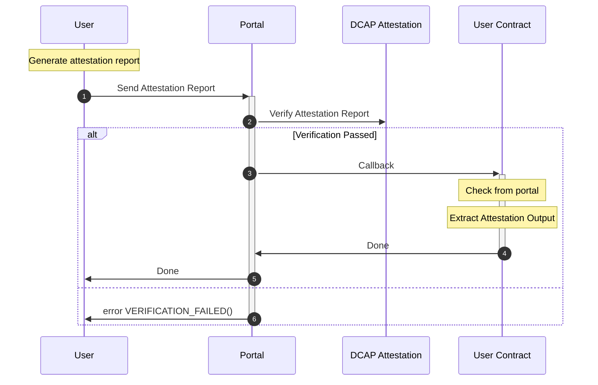

<div align="center">
  <picture>
    <source media="(prefers-color-scheme: dark)" srcset="https://raw.githubusercontent.com/automata-network/automata-brand-kit/main/PNG/ATA_White%20Text%20with%20Color%20Logo.png">
    <source media="(prefers-color-scheme: light)" srcset="https://raw.githubusercontent.com/automata-network/automata-brand-kit/main/PNG/ATA_Black%20Text%20with%20Color%20Logo.png">
    
  </picture>
</div>

## DCAP Portal
[](LICENSE)

The DCAP portal provides an entry point for [Automata DCAP attestation](http://github.com/automata-network/automata-dcap-attestation).

## Dependencies

* forge
* pnpm / npm

## Workflow



## Integration

We designed [DcapPortal](src/DcapPortal.sol) to handle the verification logic. Once verification succeeds, DcapPortal triggers a callback to the target contract. 
We provide an example to demonstrate how to integrate with it: [VerifiedCounter](src/examples/VerifiedCounter.sol)

**1. Import DcapLibCallback.sol**

```sol
import "@dcap-portal/lib/DcapLibCallback.sol"
```

**2. Extend to your contract**

```sol
contract VerifiedCounter is DcapLibCallback {
    constructor(address _dcapPortalAddress) {
        // Initial the DcapLibCallback
        __DcapLibCallbackInit(_dcapPortalAddress);
    }
}
```

**3. Add your function and restrict the caller**
```sol
contract VerifiedCounter is DcapLibCallback {
    //...

    event AttestationReportUserData(bytes);

    function setNumber(uint256 newNumber) public fromDcapPortal {
        number = newNumber;
        // get the user data from the attestation report
        emit AttestationReportUserData(_attestationReportUserData());
    }
}
```
This way ensures that your call can only be invoked after a successful attestation report verification.