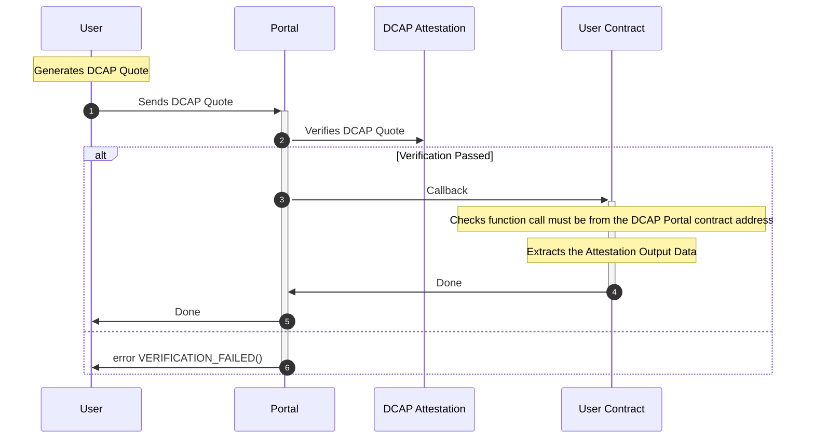

<div align="center">
  <picture>
    <source media="(prefers-color-scheme: dark)" srcset="https://raw.githubusercontent.com/automata-network/automata-brand-kit/main/PNG/ATA_White%20Text%20with%20Color%20Logo.png">
    <source media="(prefers-color-scheme: light)" srcset="https://raw.githubusercontent.com/automata-network/automata-brand-kit/main/PNG/ATA_Black%20Text%20with%20Color%20Logo.png">
    
  </picture>
</div>

## DCAP Portal
[](LICENSE)

The DCAP Portal Contract is user-facing, that submits DCAP quotes or (SNARK proofs) on the user's behalf to the [Automata DCAP attestation](http://github.com/automata-network/automata-dcap-attestation) contract.

Upon successful verification of quotes, the Portal performs a callback to the user contract with the provided calldata.

To begin building with DCAP Portal, the following dependencies must be installed on your machine:

* [Foundry](https://book.getfoundry.sh/getting-started/installation)
* pnpm / npm

## Workflow



1. The user generates an Intel DCAP Quote, which they can either:
  a. Sends it directly to the Portal contract, via `verifyAndAttestOnChain()`.
  b. Performs quote verificationn with zkVM Program executed either via RiscZero or SP1, a SNARK proof and the execution output are then sent to the contract via `verifyAndAttestWithZKProof`

Regardless of which function methods the user invokes, they also must specify the [`Callback`](./src/interfaces/IDcapPortal.sol) parameters.

2. The Portal forwards either (a) the DCAP quote for full on-chain verification or (b) SNARK proofs and the execution output to the Automata DCAP Attestation contract. Upon successful verification, the Attestation Output is returned to the Portal.

3. The Portal performs a callback on the user contract with calldata provided in the `Callback` parameters.

4. The user contract first checks that a function call is sent by the Portal contract. Once confirmed the legitimacy of the quote attestation, it has the option to extract the quote report data from the Attestation Output.

5. The Portal returns SUCCESS.

6. The Portal throws a VERIFICATION_FAILED error for invalid quotes.

## Integration

This section provides step-by-step instructions for integrating with DCAP Portal to your contract. See [VerifiedCounter](src/examples/VerifiedCounter.sol) for an example.

**1. Import DcapLibCallback.sol**

```solidity
import "@dcap-portal/lib/DcapLibCallback.sol"
```

**2. Extend to your contract**

```solidity
contract VerifiedCounter is DcapLibCallback {
    constructor(address _dcapPortalAddress) {
        // Initial the DcapLibCallback
        __DcapLibCallbackInit(_dcapPortalAddress);
    }
}
```

**3. Add your function and restrict the caller**
```solidity
contract VerifiedCounter is DcapLibCallback {
    //...

    event AttestationReportUserData(bytes);

    function setNumber(uint256 newNumber) public fromDcapPortal {
        number = newNumber;

        // extract data from the output: 
        //  * https://github.com/automata-network/automata-dcap-attestation/blob/2d8b6b3dd35643081fa7fd98bbb1323a0601b2bb/contracts/bases/QuoteVerifierBase.sol#L143
        bytes memory attestationOutput = _attestationOutput();

        // get the user data from the attestation report
        emit AttestationReportUserData(_attestationReportUserData());
    }
}
```
The `fromDcapPortal` modifier ensures that the `number` value can only be changed after successful verification of the DCAP quote.