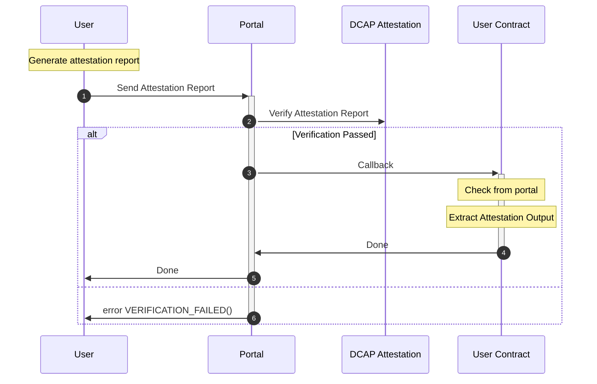

<div align="center">
  <picture>
    <source media="(prefers-color-scheme: dark)" srcset="https://raw.githubusercontent.com/automata-network/automata-brand-kit/main/PNG/ATA_White%20Text%20with%20Color%20Logo.png">
    <source media="(prefers-color-scheme: light)" srcset="https://raw.githubusercontent.com/automata-network/automata-brand-kit/main/PNG/ATA_Black%20Text%20with%20Color%20Logo.png">
    
  </picture>
</div>

# Go DCAP
[](LICENSE)

Go SDK for interacting with [Automata DCAP attestation](http://github.com/automata-network/automata-dcap-attestation)

# Workflow



# Features

* Automatically calculate the fee of the attestation verification
* Generate ZkProof through Remote Prover Network
* Submit via ZkProof or Attestation Report
* [WIP] Generate Attestation Report


# Examples

Note: VerifiedCounter can be referenced [here](../dcap-portal/src/examples/VerifiedCounter.sol)

## Verify on chain
```go
func VerifyOnChain(ctx context.Context, quote []byte, privateKeyStr string) error {
    // Create a new DCAP portal instance
    portal, err := godcap.NewDcapPortal(ctx, 
        godcap.WithChainConfig(godcap.ChainAutomataTestnet), 
        godcap.WithPrivateKey(privateKeyStr),
    )
    if err != nil {
        return err
    }

    // setup a callback function when the verification success
    //  function setNumber(uint256 newNumber) public fromDcapPortal
    callback := NewCallbackFromAbiJSON(VerifiedCounter.VerifiedCounterABI)
        .WithParams("setNumber", big.NewInt(10))
        .WithTo(verifiedCounterAddr)

    // Verify the quote on chain
    tx, err := portal.VerifyOnChain(nil, quote, callback)
    if err != nil {
        return err
    }

    // waiting for the transaction receipt
    receipt := <-portal.WaitTx(ctx, tx)
    fmt.Printf("%#v\n", receipt)
}
```

## Verify with Risc0 ZkProof
```go
// export BONSAI_API_KEY=${API_KEY}
func VerifyWithZkProof(ctx context.Context, quote []byte, privateKeyStr string) error {
    // Create a new DCAP portal instance
    portal, err := godcap.NewDcapPortal(ctx, 
        godcap.WithChainConfig(godcap.ChainAutomataTestnet), 
        godcap.WithPrivateKey(privateKeyStr),
    )
    if err != nil {
        return err
    }

    // Generate a ZkProof using Risc0, this function will take a while to finish
    zkproof, err := portal.GenerateZkProof(ctx, zkdcap.ZkTypeRiscZero, quote)
    if err != nil {
        return err
    }

    // setup a callback function when the verification success
    //  function setNumber(uint256 newNumber) public fromDcapPortal
    callback := NewCallbackFromAbiJSON(VerifiedCounter.VerifiedCounterABI)
        .WithParams("setNumber", big.NewInt(10))
        .WithTo(verifiedCounterAddr)

    // Verify the ZkProof and attest on chain
    tx, err := portal.VerifyAndAttestWithZKProof(nil, zkproof, callback)
    if err != nil {
        return err
    }

    // waiting for the transaction receipt
    receipt := <-portal.WaitTx(ctx, tx)
    fmt.Printf("%#v\n", receipt)
}
```


## Verify with Succinct ZkProof
```go
// export SP1_PRIVATE_KEY=${KEY}
func VerifyWithZkProof(ctx context.Context, quote []byte, privateKeyStr string) error {
    // Create a new DCAP portal instance
    portal, err := godcap.NewDcapPortal(ctx, 
        godcap.WithChainConfig(godcap.ChainAutomataTestnet), 
        godcap.WithPrivateKey(privateKeyStr),
    )
    if err != nil {
        return err
    }

    // Generate a ZkProof using Succinct, this function will take a while to finish
    zkproof, err := portal.GenerateZkProof(ctx, zkdcap.ZkTypeSuccinct, quote)
    if err != nil {
        return err
    }

    // setup a callback function when the verification success
    //  function setNumber(uint256 newNumber) public fromDcapPortal
    callback := NewCallbackFromAbiJSON(VerifiedCounter.VerifiedCounterABI)
        .WithParams("setNumber", big.NewInt(10))
        .WithTo(verifiedCounterAddr)

    // Verify the ZkProof and attest on chain
    tx, err := portal.VerifyAndAttestWithZKProof(nil, zkproof, callback)
    if err != nil {
        return err
    }

    // waiting for the transaction receipt
    receipt := <-portal.WaitTx(ctx, tx)
    fmt.Printf("%#v\n", receipt)
}
```

